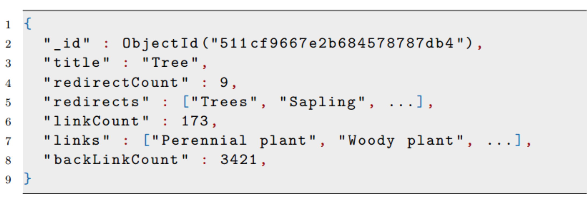
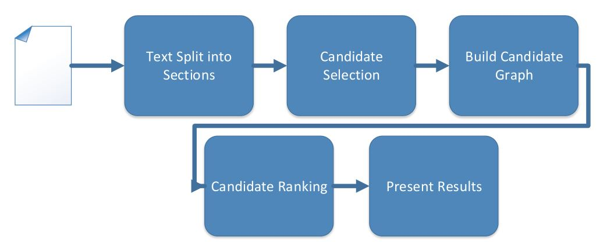
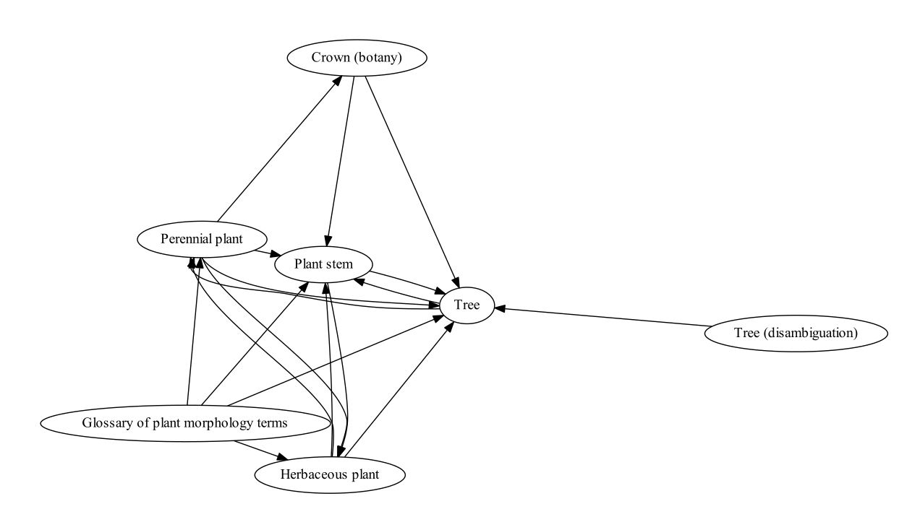

# topic-extraction

This project is part of my master thesis project at KTH Royal Institute of Technology.

Project Title: Subtopic extraction using graph-based methods.

This code was used to explore subtopic extraction using search engine technology, combined with graph centrality ranking of topic candidates.

More info about the thesis project can be found at: http://www.nada.kth.se/~markusos/thesis/

## Setup

### Requirements

 - [MongoDB](http://www.mongodb.org/)
 - [ElasticSearch](http://www.elasticsearch.org/)

### Index Ontology

To build the Ontology used for the topic extraction we use the DBpedia Wikipedia Pagelinks Dataset.

- Download DBpedia Wikipedia Pagelinks Dataset: [page_links_bg.nt.bz2](http://data.dws.informatik.uni-mannheim.de/dbpedia/2014/bg/page_links_bg.nt.bz2)
- Download and install MongoDB
- Download and install ElasticSearch

- Start MongoDB
- Start ElasticSearch
- Extract 'page_links_bg.nt.bz2' in the project directory
- Run the command 'mvn clean install' in the project directory

- Run the 'com.findwise.topic.Main' class with the input parameter '-i' to start the indexing. Expect this to take several hours depending on your computer performance.
 It catalogues the whole link structure from Wikipedia into MongoDB for pre processing and then indexes the data into ElasticSearch. Keep an eye on the log.txt file to see the progress.

#### Indexed Data Example

### Extract topics

- Run the 'com.findwise.topic.Main' class with the input parameter '-e' to extract topics from "test_input.txt" file. You can change the input file in 'com.findwise.topic.extractor.Main' and tweak the parameters for the system.
- When done, the file 'result.html' contains the result as well as the relationship graph of the found topics.

### Workflow

## Example

Encyclopedia Britannicas definition of Tree:

> Tree, woody plant that regularly renews its growth (perennial).
> Most plants classified as trees have a single self-supporting trunk containing woody tissues,
> and in most species the trunk produces secondary limbs, called branches.

### Result:

- Tree
- Perennial plant
- Plant stem
- Herbaceous plant
- Glossary of plant morphology terms
